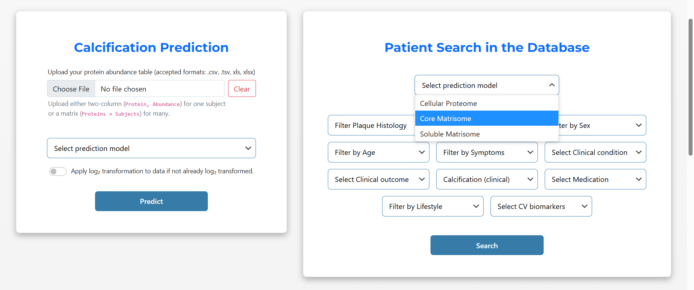
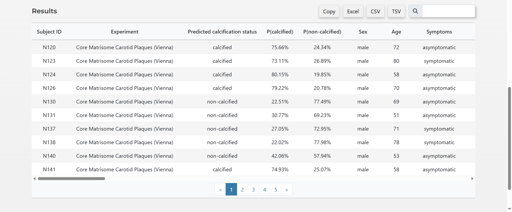
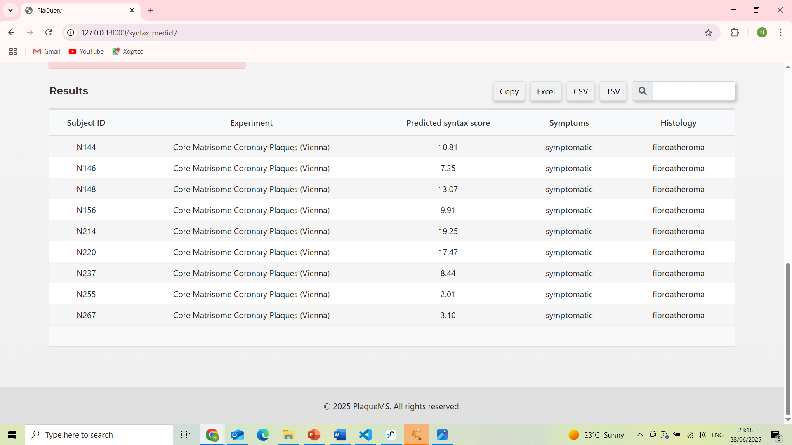

# PlaqueMS

## *An Integrative Web Platform for Atherosclerosis Omics Analysis.*
Facilitating Visual and Predictive Insights into Atherosclerotic Plaque Biology

## **Project Description**
**PlaqueMS** is an integrative web platform for the exploratory and predictive analysis of human atherosclerotic plaques using multi-omics data, with a primary focus on proteomics. Developed in Django, it provides interactive tools for protein abundance analysis, exploration of differential expression analysis results, protein–protein interaction network visualization (powered by Cytoscape), and predictive modeling of clinically relevant outcomes such as plaque calcification status and SYNTAX score.

The platform integrates a MySQL relational database for structured storage of differential expression results, precomputed visual outputs (e.g. box plots, volcano plots, heatmaps), and protein network-related files. A complementary Neo4j graph database is employed for capturing more complex relationships among patients, clinical metadata, experimental protocols, tissue regions, and protein abundance measurements. This dual-database architecture enables dynamic, phenotype-specific queries across plaque regions and cohorts. Secure user authentication, role-based access control, and an administrative interface support responsible data management and user oversight.

By combining rich exploratory capabilities with machine learning-based prediction, PlaqueMS offers a comprehensive framework for advancing translational cardiovascular research.

<h3 align="center">System Architecture</h3>

  

>*High-level overview of the system architecture of PlaqueMS. Solid arrows indicate data flow from the frontend to the backend (user actions, HTTP/AJAX requests, and queries to the database), while dashed arrows represent data or results returned from the backend to the frontend, including rendered web pages, interactive visualizations, and downloadable files. Colored boxes distinguish the platform’s major components: purple denotes frontend user interface modules, green highlights backend logic and Django views, red indicates databases (MySQL and Neo4j), and grey represents external tools and machine learning modules. Certain modules and functionalities are accessible only to authenticated users or administrators. This diagram illustrates the coordinated interactions that enable seamless data analysis and visualization within the platform.*

---

## Results

This section summarises the core modules and functionalities of PlaqueMS, following the structure of the system as presented in the thesis.

---

### 3.1.1 Home Page

  

The Home page serves as the entry point of the platform, providing an overview of PlaqueMS and its purpose.  
It introduces users to the biological context of atherosclerosis and highlights the platform’s capabilities in multi-omics data exploration and predictive modelling.

Precomputed visualisations (e.g. heatmaps and differential expression summaries) are presented to give immediate insight into the underlying datasets.

---

### 3.1.2 Proteins Page

  

The Proteins module enables querying of protein information using gene names or UniProt accession IDs.

Users can:
- Retrieve protein annotations and mappings  
- Explore protein presence across experiments  
- Access harmonised identifiers across datasets  

This module supports efficient navigation between molecular entities and experimental data.

---

### 3.1.3 Differential Expression Analysis

  

This module provides interactive access to differential expression results across cohorts and experimental conditions.

Key features include:
- Volcano plots highlighting significantly regulated proteins  
- Integration of statistical metrics (logFC, p-values)  
- Identification of biologically relevant markers  

The interface allows users to explore molecular differences between plaque phenotypes.

---

### 3.1.4 Protein Networks Page

  

The Protein Networks module enables interactive exploration of protein–protein interaction (PPI) networks.

Users can:
- Visualise network structures derived from proteomic data  
- Apply clustering (e.g. MCL) to identify functional modules  
- Overlay differential expression results on network nodes  

This supports systems-level interpretation of plaque biology.

---

### 3.1.5 Authentication System Interface

  
  

PlaqueMS includes a secure authentication system with:

- User registration and login  
- Password validation and protection mechanisms  
- Role-based access control  

Certain modules are restricted to authenticated users, ensuring controlled access to sensitive data.

---

### 3.1.6 PlaQuery: Restricted Access Modules

  
  
  

PlaQuery provides advanced querying capabilities across the integrated datasets.

Users can filter data based on:
- Tissue region  
- Clinical phenotype  
- Demographics (age, sex)  
- Experimental conditions  

This enables phenotype-driven exploration of multi-cohort proteomics data.

---

### 3.1.7 Protein Abundance Page

  

This module displays quantitative protein abundance values across samples and experiments.

Features include:
- Structured tabular output  
- Summary statistics (average, min, max abundance)  
- Export functionality (CSV, Excel, TSV)  

It supports direct comparison of protein expression across cohorts and plaque regions.

---

### 3.1.8 Calcification & SYNTAX Score Prediction

  
  
  
  

The prediction module integrates machine learning models trained on proteomics data.

Users can:
- Upload protein abundance data  
- Select specific proteomic subsets (e.g. Core Matrisome)  
- Obtain probabilistic predictions for:
  - Plaque calcification status  
  - SYNTAX score  

Outputs include both classification results and probability scores, enabling more nuanced interpretation.

---

### 3.2 Model Performance and Validation

  
  
  

Model predictions demonstrated significant correlation with clinical imaging metrics:

- Calcium mass  
- CT score  
- Plaque volume  

This indicates that the models capture continuous variation in calcification burden rather than simple binary outcomes.

---

### 3.3 Clinical Stratification

  

The model differentiates between asymptomatic and symptomatic patients:

- Higher predicted calcification probabilities in asymptomatic cases  
- Statistically significant separation between groups  

This supports the clinical relevance of the predictive models.

---

## 📄 Full Thesis

For full methodology, evaluation, and discussion:

👉 [PlaqueMS Thesis PDF](./Thesis%20project%20Nikolaos%20Samperis.pdf)

